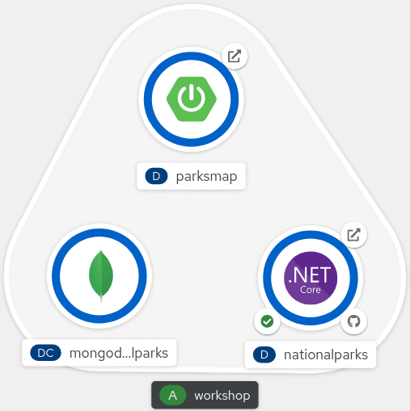

# OpenShift Starter Guides

image::https://github.com/redhat-scholars/openshift-starter-guides/workflows/docs/badge.svg[docs]

## Overview

|===
|| 

|Audience Experience Level
|Beginner

|Average Time to Complete	
|90 minutes
|===

This workshop is intended to give you a hands on introduction to using https://openshift.com[OpenShift] from the perspective of a Developer. 

https://www.redhat.com/en/topics/containers/whats-a-linux-container-vb[Containers] are a standardized way to package apps with all of their dependencies to simplify deployment and speed delivery. Unlike virtual machines, containers do not bundle to the operating system. Only the application code, run time, libraries, and settings are packaged inside of containers. Thus, containers are more lightweight, portable, and efficient as compared to virtual machines.

For developers looking to kickstart their projets, OpenShift enables efficient application development through streamlined workflows and validated integrations.

### Objectives

* Using the OpenShift command line (CLI) and Web Console.
* Deploying an application using a pre-existing Container Image.
* Working with application Labels to identify component parts.
* Scaling up your application in order to handle web traffic.
* Exposing your application to users outside of the cluster.
* Viewing and working with Logs generated by your application.
* Accessing your application container and interacting with it.
* Giving access to other users to collaborate on your application.
* Deploying an application from Source Code in a Git repository.
* Deploying a Database from the OpenShift Developer Catalog.
* Configuring an application so it can access a database.
* Setting up Web Hooks to enable automated application builds.
* Additional topics may also be covered relevant to the specific programming language used by the applications being deployed.

## Documentation

This workshop is based on link:https://antora.org/[Antora] and link:https://github.com/redhat-scholars/courseware-template[Red Hat scholars template] to build HTML based tutorials.

To start this workshop, follow the step by step tutorial link for your cluster available below: 

[%header,cols=5*] 
|===
|OpenShift
|Java Path
|.NET Path
|Javascript Path
|Python Path  

|link:https://www.openshift.com/try[OpenShift 4.6 Cluster]
|link:https://redhat-scholars.github.io/openshift-starter-guides/[Guide]
|link:https://redhat-scholars.github.io/openshift-starter-guides-dotnet/[Guide]
|link:https://redhat-scholars.github.io/openshift-starter-guides-javascript/[Guide]
|link:https://redhat-scholars.github.io/openshift-starter-guides-python/[Guide]

|link:https://developers.redhat.com/products/codeready-containers/overview[CRC 4.6]
|link:https://redhat-scholars.github.io/openshift-starter-guides/rhs-openshift-starter-guides/4.6/index.html?CLUSTER_SUBDOMAIN=apps-crc.testing[Guide]
|link:https://redhat-scholars.github.io/openshift-starter-guides-dotnet/rhs-openshift-starter-guides-dotnet/4.6/index.html?CLUSTER_SUBDOMAIN=apps-crc.testing[Guide]
|link:https://redhat-scholars.github.io/openshift-starter-guides-javascript/rhs-openshift-starter-guides-javascript/4.6/index.html?CLUSTER_SUBDOMAIN=apps-crc.testing[Guide]
|link:https://redhat-scholars.github.io/openshift-starter-guides-python/rhs-openshift-starter-guides-python/4.6/index.html?CLUSTER_SUBDOMAIN=apps-crc.testing[Guide]

|link:https://learn.openshift.com/playgrounds/openshift46/[OpenShift 4.6 Playground] 
|link:https://redhat-scholars.github.io/openshift-starter-guides/rhs-openshift-starter-guides/4.6/index.html?USERNAME=admin&PASSWORD=admin[Guide]
|link:https://redhat-scholars.github.io/openshift-starter-guides-dotnet/rhs-openshift-starter-guides-dotnet/4.6/index.html?USERNAME=admin&PASSWORD=admin[Guide]
|link:https://redhat-scholars.github.io/openshift-starter-guides-javascript/rhs-openshift-starter-guides-javascript/4.6/index.html?USERNAME=admin&PASSWORD=admin[Guide]
|link:https://redhat-scholars.github.io/openshift-starter-guides-python/rhs-openshift-starter-guides-python/4.6/index.html?USERNAME=admin&PASSWORD=admin[Guide]

|link:https://cloud.ibm.com/docs/openshift?topic=openshift-roks-overview[ROKS/ OpenShift 4.5]
|link:https://redhat-scholars.github.io/openshift-starter-guides/rhs-openshift-starter-guides/4.5/index.html[Guide]
|n/a
|n/a
|n/a

|===

### Lab Parameters

This lab supports both link:site.yml#L17[Antora variables] than query parameters. Query params makes the workshop content dynamic, like URLs specific for your cluster to copy and paste.

NOTE: In the table above, CRC and Playground links use them.

Here's the list of all query params used (they are all optional, but generated links won't work unless at least `CLUSTER_SUBDOMAIN` is set):

[%header,cols=2*] 
|===
|PARAM
|Description

|`CLUSTER_SUBDOMAIN`
|The subdomain for your OpenShift cluster in the form `apps.<cluster_name>.<base_domain>`, e.g. `apps.openshift.mydomain.tld`

|`USERNAME`
| The username of your OpenShift cluster

|`PASSWORD`
| The password for your OpenShift cluster

|`LOGIN`
| Only for ROKS clusters, the IBM Cloud login URL for authentication

|===

Example:

https://redhat-scholars.github.io/openshift-starter-guides/rhs-openshift-starter-guides/4.6/index.html?CLUSTER_SUBDOMAIN=apps-crc.testing&USERNAME=developer&PASSWORD=developer

## Contributing

Please refer to the link:CONTRIBUTING.adoc#contributing-guide[how to contribute] on how you can contribute to the tutorial

 
